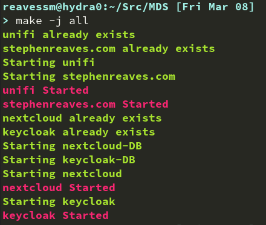
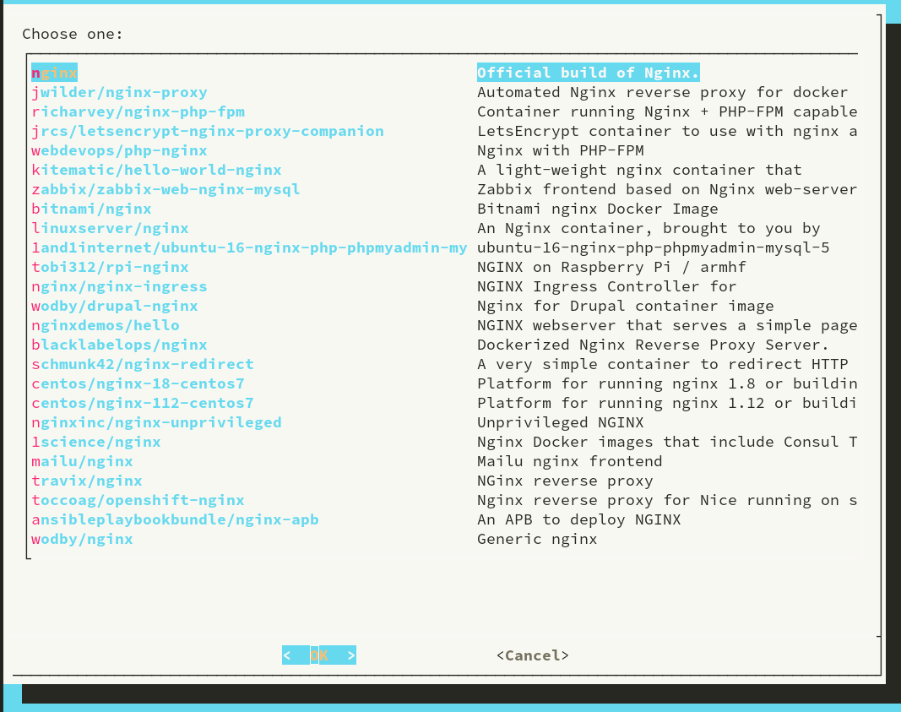
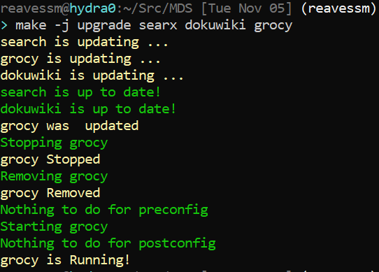

# MDS

An init framework for homelab services.

## Usage

MDS is essentially a `make` wrapper for docker.  Typing `make new` will allow
you to create a new container.  It creates a new directory, and inside that
directory, it makes an `mds.sh` script.  That script is responsible for
starting, stopping, removing, building, and running the docker container(s).

Adding new services is as simple as `make search`.  This will start a series of
`dialog` menus to allow you to search for the docker container that you want.
MDS will then open the correct `mds.sh` script in your default editor.

After creating the new service, typing `make <foo>` will build (if needed),
start (if needed), and run the container.  You can also type 
`make remove <foo>`, `make stop <foo>`, or `make start <foo>` to remove, stop,
and start the container respectively.

MDS also automatically handles configuring an encrypted reverse proxy based on
the 'enabled' services (enabled here means the directory ends with '.d').
Specifying the 'exposedPort' variable in an enabled directory will mean that
service gets a subdomain evertyime `make proxyReset` is run.  That command
will also prompt you for your top level domain name everytime it's run, or you
can just write in 'proxy.d/domain.txt'.

The biggest strength of MDS is it's customizability.  You can override the `run` 
command to run a `docker-compose` script instead of a single container.  You
could also override the `run` command to do nothing and just point the
exposedPort and conIP to another VM if all you need is a proxy.  The sky is the
limit!

## Here are some pretty screenshots

Starting all the containers in parellel

 

Searching for a new contianer image

 

Upgrading several containers in parellel

## Examples

### Starting from Scratch
1. Configure your DNS.  You should only need two records, 'domain.com' and '\*.domain.com', both pointing to your host.
1. `git clone https://github.com/reavessm/MDS.git && cd MDS`
1. `make init`
1. Follow the prompts, changing variables as needed
1. Enjoy your services!
    * Everything should be in a directory called `<nameOfService>.d`, which points to 'https://<nameOfService>.domain.com'
    * If you want to point something to just 'domain.com' move it to the special website.d folder: 
        1. Stop the service with `make stop service`
        1. Rename the folder with `mv service.d website.d`
        1. Start it back up with `make website`
        1. Reset the proxy `make proxyReset`

### Nextcloud

1. Configure your DNS.  You should only need two records, 'domain.com' and '\*.domain.com', both pointing to your host.
1. `git clone https://github.com/reavessm/MDS.git && cd MDS`
1. `make search nextcloud`
1. Change the 'exposedPort' variable to be the port you want open on your machine. This should be whatever you map to port 80 on Nextcloud.
    * Optionally, you can change any of the other 'args'.  There are a lot of unnecessary '-e' flags, so have fun with that.
1. exit vim ('<Esc>:wq', or '<Esc>:x', or '<Esc>ZZ')
1. `make proxyReset`
1. In a web browswer, go to 'http://nextcloud.domain.com'
