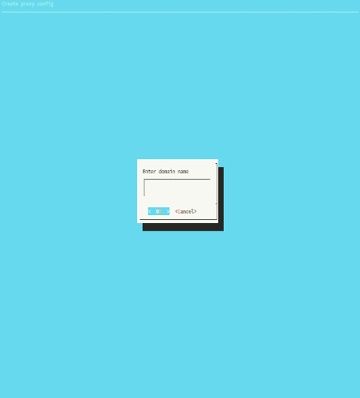

MDS Reverse Proxy
=================

This one is a little different than the rest.  There's a few more requirements:

1. You need a domain.  I use [Google Domains](https://domains.google.com), but I have also used [Go Daddy](https://www.godaddy.com).  I recommend either of those registrars, but this should work for any one you can find.
1. You need a wildcard subdomain.  You need '\*.domain.com' to redirect to the same place as 'domain.com'.
1. You need a host server.  It doesn't have to be beefy, a [raspberry pi](https://www.raspberrypi.org) will probably work.  This host requires bash, and docker.  This might not work on anything other than GNU/Linux.  It runs fine on Gentoo, so any distro should work.
1. You need to add the 'exposedPort' flag in the subdomains that you want to be visible to the outside world.  You can look around [my website](https://github.com/reavessm/MDS/blob/master/website.d/mds.sh) for an example.
1. You need to run the `autoconfig.sh` script.  You can pass in the top level domain as an argument to that command, or you can enter it in the dialog if you don't provide an argument.

 

That's it!  Then you can run `make proxy` and everything should take care of itself!
